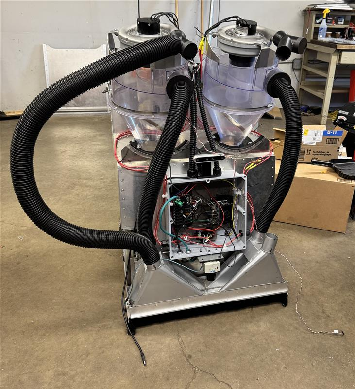

A ROS2-based differential drive robot with advanced sensor integration, autonomous navigation, and teleoperation capabilities.

## 👥 Credits

Developed by:
- **Alexnader Roller** ([AlexanderRoller](https://github.com/AlexanderRoller)) - Systems integration
- **Jason Koubi** ([jkoubs](https://github.com/jkoubs)) - Software and simulation
- **Benjamin Cantarero** - Mechanical design

## 📋 Table of Contents

- [Overview](#overview)
- [Features](#features)
- [Hardware](#hardware)
- [Installation](#installation)
- [Usage](#usage)
- [Package Structure](#package-structure)
- [Troubleshooting](#troubleshooting)
- [License](#license)

## 🔍 Overview

The Sucky Robot is a comprehensive ROS2 robotics platform designed for autonomous navigation, mapping, and teleoperation. It features a differential drive system with advanced sensor integration including LiDAR, depth cameras, and IMU sensors.

### Key Components:
- **Differential Drive Base**: Custom roboclaw motor controller integration
- **Sensor Suite**: SICK LiDAR, Intel RealSense D455, IMU
- **Navigation Stack**: SLAM mapping, autonomous navigation, obstacle avoidance
- **Teleoperation**: Joystick control with twist multiplexing
- **Monitoring**: Battery monitoring and system status

## ✨ Features

- 🎮 **Joystick Teleoperation**: Real-time control with configurable speed limits
- 🗺️ **SLAM Mapping**: Real-time simultaneous localization and mapping
- 🧭 **Autonomous Navigation**: Path planning and obstacle avoidance
- 📡 **Multi-sensor Fusion**: EKF-based sensor fusion for robust localization
- 🔋 **Battery Monitoring**: Real-time battery voltage monitoring with low-battery warnings
- 🛠️ **Hardware Integration**: Custom roboclaw motor controller interface
- 🎯 **Precision Control**: Differential drive with accurate odometry

## 🛠️ Hardware

### Robot Platform
- **Base**: Custom differential drive chassis
- **Wheels**: Two motorized wheels with encoders

### Sensors
- **LiDAR**: SICK TiM781 (270° field of view)
- **Camera**: Intel RealSense D455 depth camera
- **IMU**: Integrated inertial measurement unit
- **Encoders**: Wheel encoders for odometry

### Control Hardware
- **Motor Controller**: Roboclaw motor controller
- **Communication**: Serial communication over USB/TTY
- **Power**: 24V battery system with monitoring

## 📦 Installation

### Prerequisites
- ROS2 Humble/Iron/Jazzy
- Ubuntu 22.04 or later
- Python 3.8+

### Dependencies
```bash
# Install system dependencies using rosdep
sudo apt update
sudo rosdep init  # if not already initialized
rosdep update

# Install ROS2 dependencies (excluding roboclaw packages)
rosdep install --from-paths src --ignore-src -r -y --skip-keys="roboclaw_hardware_interface roboclaw_serial"

# Install Python dependencies
pip install pyserial
```

### Build Instructions
```bash
# Clone the repository
git clone <repository_url> ~/sucky_robot
cd ~/sucky_robot

# Build the workspace
colcon build --symlink-install

# Source the workspace
source install/setup.bash
```

## 🚀 Usage

### Quick Start with Shell Scripts
The repository includes convenient shell scripts for common operations:

```bash
# Build the workspace
source build.sh

# Launch the robot system
source launch.sh
```

### ROS2 Networking Setup
For multi-machine operation (robot + host computer), ensure both machines use the same ROS_DOMAIN_ID:

```bash
# On both robot and host computer
export ROS_DOMAIN_ID=1
```

**⚠️ Enterprise Network Considerations:**
- Many enterprise networks block multicast traffic, which ROS2 uses for node discovery
- If nodes can't discover each other, contact IT to allow multicast on ports 7400-7447
- Alternative: Use ROS2 discovery server or configure static peer discovery

### Computational Offloading
The distributed nature of ROS2 allows you to offload computationally intensive tasks from the robot to a more powerful host machine:

- **Robot**: Runs sensor drivers, motor control, and basic navigation
- **Host**: Handles complex processing like mapping, path planning, and visualization
- **Benefits**: Extends battery life, reduces heat generation, enables more sophisticated algorithms

### Creating Useful Aliases
Add these to your `~/.bashrc` for convenience:

```bash
# Robot workspace aliases
alias build='cd ~/sucky_robot && source build.sh'
alias launch_sucky='cd ~/sucky_robot && source launch_sucky.sh'
alias launch_host='cd ~/sucky_robot && source install/setup.bash && source launch_host.sh'
```

### Manual Launch Commands
```bash
# Launch the complete robot system (on robot)
ros2 launch sucky sucky_launch.py

# Launch only SLAM
ros2 launch sucky sucky_slam.py

# Launch only camera
ros2 launch sucky realsense_launch.py

# Launch RViz on host computer
ros2 launch sucky host_launch.py
```

### Teleoperation
```bash
# Connect a joystick and launch teleoperation
ros2 launch sucky sucky_launch.py

# Manual control via keyboard (alternative)
ros2 run teleop_twist_keyboard teleop_twist_keyboard
```

### Monitoring
```bash
# Monitor battery voltage
ros2 topic echo /battery_voltage

# View all active topics
ros2 topic list

# Check node status
ros2 node list
```

## 📁 Package Structure

```
sucky_robot/
├── src/
│   ├── sucky/                          # Main robot package
│   │   ├── launch/                     # Launch files
│   │   │   ├── sucky_launch.py        # Main launch file
│   │   │   ├── sucky_slam.py          # SLAM launch file
│   │   │   ├── realsense_launch.py    # Camera launch file
│   │   │   ├── host_launch.py         # RViz host launch file
│   │   │   └── roboclaw_battery_monitor_shared.launch.py
│   │   ├── config/                     # Configuration files
│   │   │   ├── sucky_controllers.yaml # Motor controller config
│   │   │   ├── joystick.yaml          # Joystick configuration
│   │   │   ├── ekf.yaml               # EKF fusion parameters
│   │   │   ├── slam.yaml              # SLAM parameters
│   │   │   ├── twist_mux.yaml         # Twist multiplexer config
│   │   │   ├── battery_monitor.yaml   # Battery monitoring config
│   │   │   └── rviz.rviz              # RViz configuration
│   │   ├── urdf/                       # Robot description
│   │   │   ├── robot.urdf.xacro       # Main robot URDF
│   │   │   ├── robot_core.xacro       # Robot chassis
│   │   │   ├── ros2_control.xacro     # Control interface
│   │   │   └── sensor_*.xacro         # Sensor definitions
│   │   ├── meshes/                     # 3D models
│   │   ├── scripts/                    # Python utilities
│   │   ├── CMakeLists.txt              # Build configuration
│   │   └── package.xml                 # Package metadata
│   ├── roboclaw_hardware_interface/    # Motor controller interface
│   └── roboclaw_serial/               # Serial communication
├── build/                              # Build artifacts
├── install/                            # Install space
├── log/                                # Build and runtime logs
├── media/                              # Images and documentation
│   └── sucky.jpeg                      # Robot photo
├── build.sh                           # Build script
├── launch.sh                          # Launch script
├── launch_sucky.sh                    # Robot launch script
├── launch_host.sh                     # Host launch script
└── README.md                          # This file
```

## ⚙️ Configuration

### Hardware Configuration
- **LiDAR IP**: `192.168.0.1` (default)
- **Serial Port**: `/dev/ttyACM0` (roboclaw)
- **Roboclaw Address**: `128`
- **Battery Voltage Range**: 22.0V - 29.4V

## 🔧 Troubleshooting

### Common Issues

#### 1. Serial Port Access
```bash
# Add user to dialout group
sudo usermod -a -G dialout $USER
# Logout and login again

# Check port permissions
ls -la /dev/ttyACM*
```

#### 2. LiDAR Connection
```bash
# Check network connection
ping 192.168.0.1

# Verify LiDAR topics
ros2 topic list | grep scan
```

#### 3. Camera Issues
```bash
# Check camera connection
lsusb | grep Intel

# Restart camera node
ros2 lifecycle set /camera/realsense2_camera_node shutdown
ros2 lifecycle set /camera/realsense2_camera_node activate
```

#### 4. Motor Controller
```bash
# Check roboclaw connection status
ros2 topic list | grep roboclaw

# Monitor motor commands
ros2 topic echo /diffbot_base_controller/cmd_vel_unstamped
```

### Performance Optimization
- Reduce sensor update rates if CPU usage is high
- Adjust EKF frequency based on system performance
- Use `log` output level for production to reduce console spam

## 🙏 Acknowledgments

- ROS2 community for the excellent robotics framework
- SICK AG for LiDAR sensor support
- Intel for RealSense camera integration
- Contributors and maintainers of the roboclaw driver

---

For questions or support, please open an issue or contact the maintainers.
